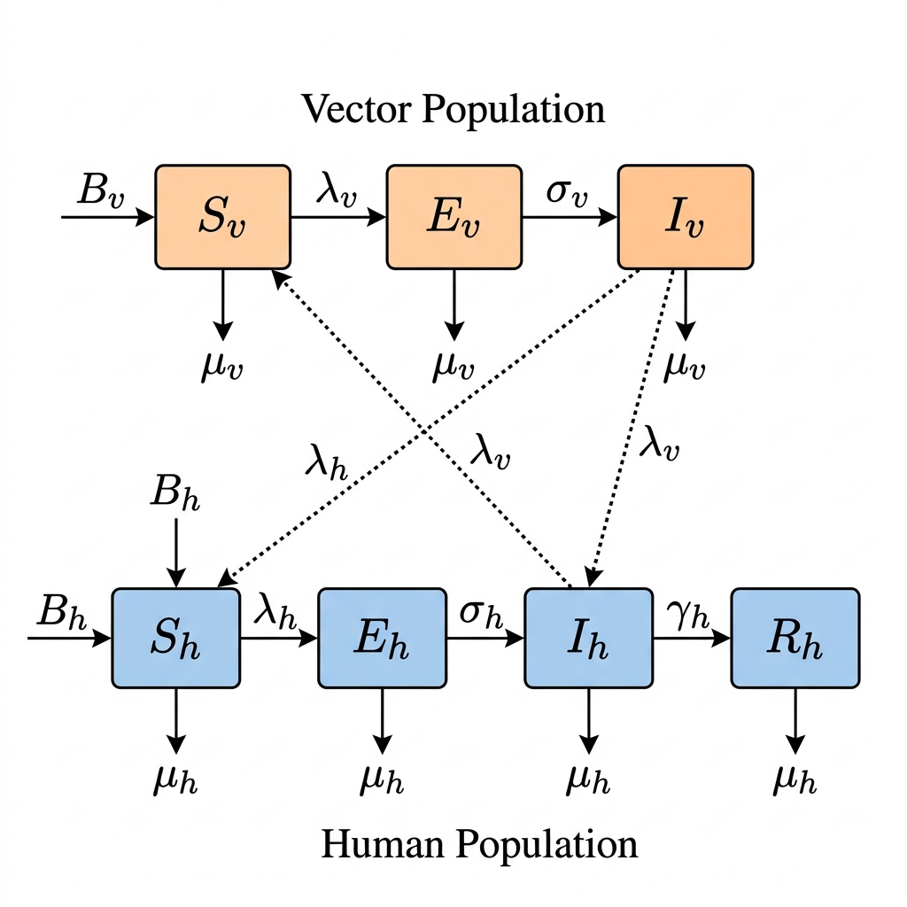
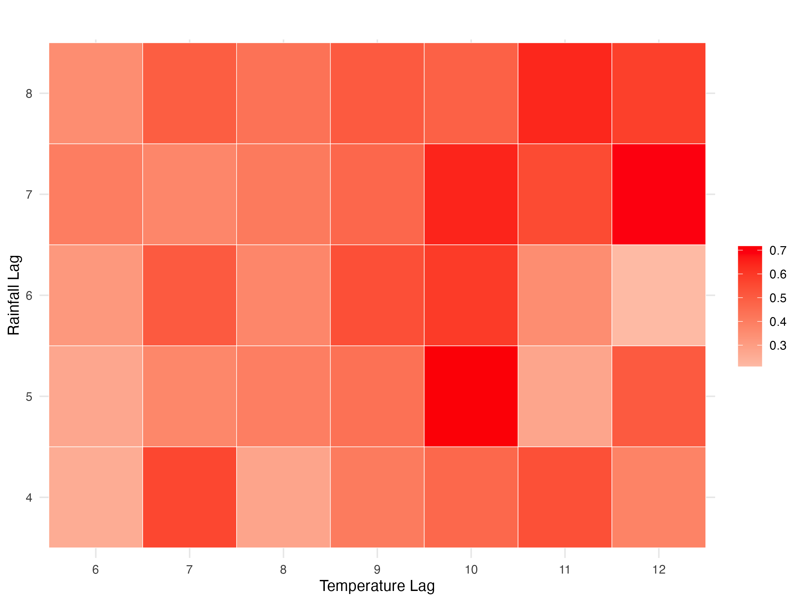
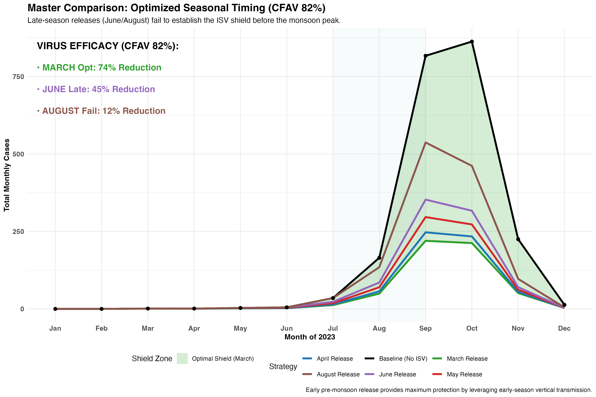
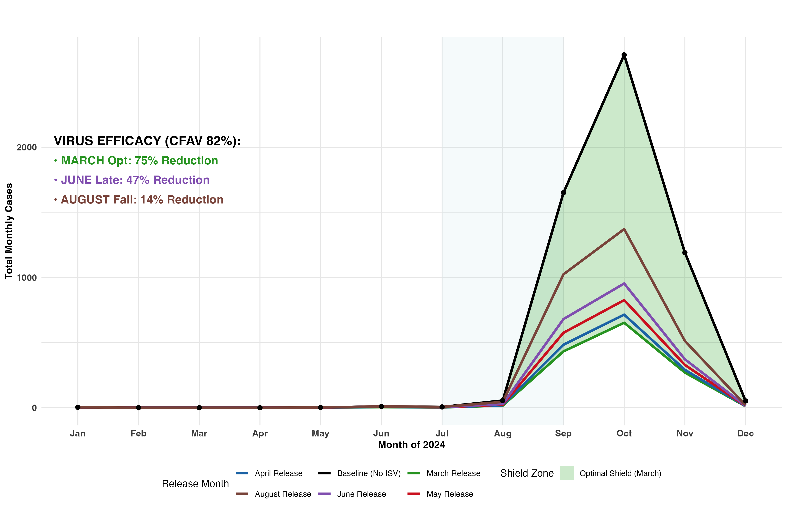
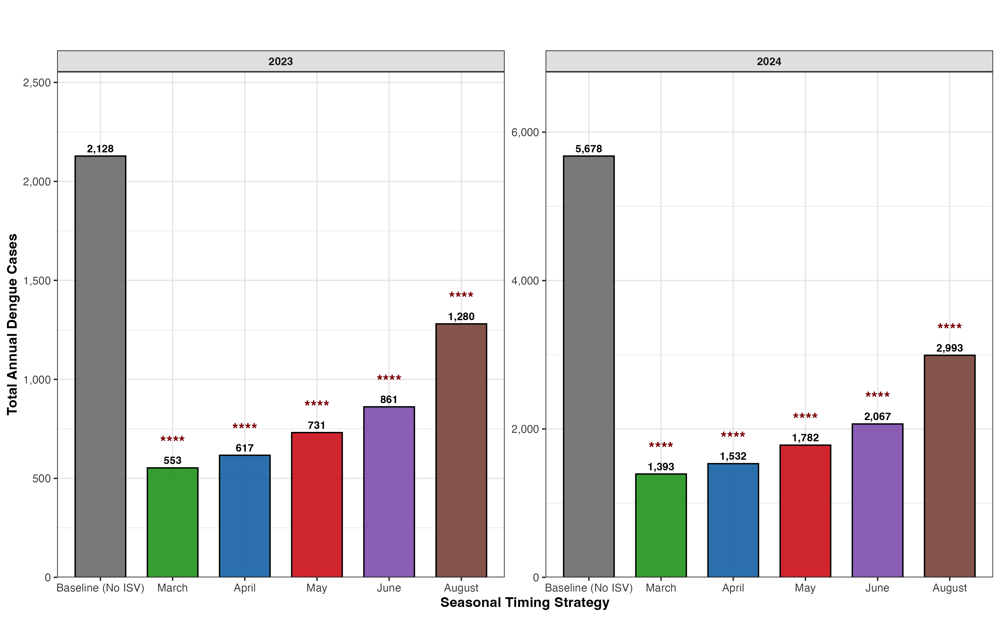
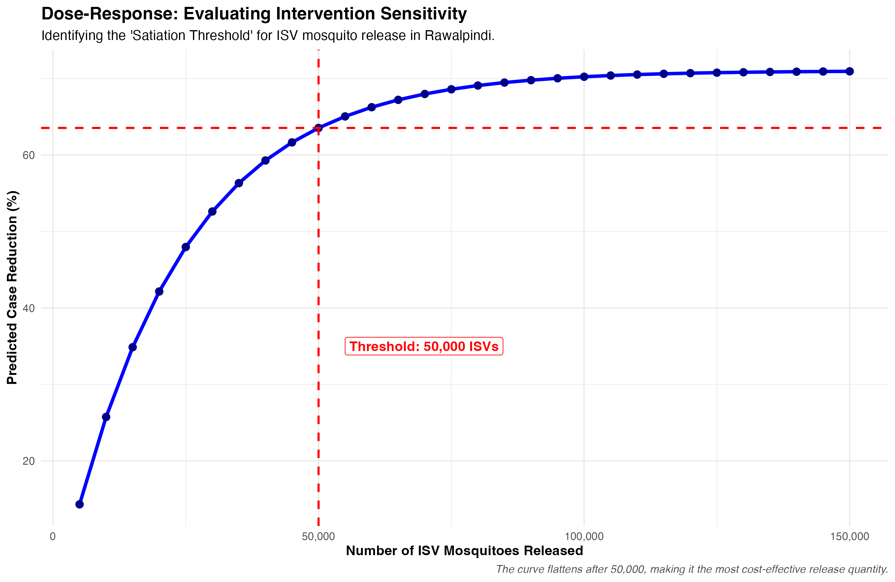

## **Modeling Optimal ISV Release for Dengue Suppression**

## 1. Introduction

Dengue fever is a critical public health challenge in Pakistan, following a highly predictable seasonal rhythm characterized by explosive outbreaks between August and November during the Monsoon season. Each year, the Rawalpindi district home to the twin cities' 6.1 million residents experiences transmission surges driven by the *Aedes aegypti* vector. Traditional control measures, primarily reactive chemical spraying, have reached a point of diminishing returns due to widespread insecticide resistance (Ranson et al., 2010).

This study proposes a proactive biological alternative: the release of mosquitoes carrying Insect-Specific Viruses (ISVs). These viruses exploit the principle of Superinfection Exclusion (SIE), where a primary ISV infection prevents the establishment of the dengue virus within the mosquito. By leveraging high vertical transmission rates, we hypothesize that a pre-monsoon release in March can fundamentally alter the transmission landscape of Rawalpindi.

> [!NOTE]
> **Data and Code Availability**: The complete source code and longitudinal datasets (2013–2024) for this study are openly available at the following GitHub repository: [https://github.com/ishhu840/Infectious-Disease-Modelling-Applied-Methods-in-R](https://github.com/ishhu840/Infectious-Disease-Modelling-Applied-Methods-in-R)

### List of Abbreviations

| Abbreviation      | Definition                                                |
| :---------------- | :-------------------------------------------------------- |
| **CFAV**    | Cell-Fusing Agent Virus                                   |
| **ISV**     | Insect-Specific Virus                                     |
| **SIE**     | Superinfection Exclusion                                  |
| **SEIR**    | Susceptible-Exposed-Infectious-Recovered (Human Dynamics) |
| **SEI**     | Susceptible-Exposed-Infectious (Vector Dynamics)          |
| **ODE**     | Ordinary Differential Equation                            |
| **$R_t$** | Effective Reproduction Number                             |
| **RMSE**    | Root Mean Square Error                                    |
| **PMD**     | Pakistan Meteorological Department                        |
| **PBS**     | Pakistan Bureau of Statistics                             |
| **FIR**     | Filial Infection Rate (Vertical Transmission)             |
| **VT**      | Vertical Transmission                                     |

## 2. Objective & Hypotheses

### 2.1 Primary Aim

Can the optimally timed pre-monsoon release of ISV-infected mosquitoes maintain the effective reproduction number ($R_t$) below the epidemic threshold ($R_t < 1$) during the seasonal peak in Rawalpindi?

### 2.2 Hypotheses

The primary hypothesis of this study is that a March intervention is the most effective strategy because it utilizes early-season vertical establishment a biological process where the ISV virus spreads from mother mosquitoes to their offspring before the monsoon begins. This timing allows the ISV virus to achieve **pre-emptive niche saturation** (effectively 'taking over' the vector population) before the dengue virus starts to circulate. Consequently, this early strategy is predicted to achieve a significantly higher reduction in clinical incidence compared to reactive alternatives initiated in August.

---

### 3.1 Data Source and Study Population

The study utilizes a longitudinal epidemiological dataset (2013–2024) for Rawalpindi. This includes **26,994 laboratory-confirmed dengue cases** and daily meteorological variables (temperature, relative humidity, and precipitation) sourced from the Pakistan Meteorological Department and local health authorities. To ensure geographical accuracy, we interpolated human population levels from 2017 and 2023 census data, modeling the city's growth from 5.4 million to 6.1 million residents.

---

## 4. Modelling Approach & Methods

### 4.1 Mathematical Framework

We implement a deterministic host–vector compartmental model using the continuous-state engine in R (Soetaert et al., 2010). Humans follow **SEIR** dynamics, while mosquitoes follow **SEI** dynamics (transmission only). The theoretical framework, including the ISV-Shield blocking mechanism, is visualized in **Figure 1**.

***Figure 1: Schematic of the SEIR-ISV Transmission Framework.** The schematic illustrates the coupled dynamics between the Human SEIR system and the Vector SEI population. Dotted interaction arrows define the cross-species infection loop, where the force of infection on each species depends on the infectious population of the other.*

The core system of Ordinary Differential Equations (ODEs) is defined as:

**Human Dynamics:**

$$
\frac{dS_h}{dt} = -\frac{a \beta_{v \to h} I_v}{N_h} S_h - \mu_h S_h + \omega R_h \quad \dots (1)
$$

$$
\frac{dE_h}{dt} = \frac{a \beta_{v \to h} I_v}{N_h} S_h - (\sigma_h + \mu_h) E_h \quad \dots (2)
$$

$$
\frac{dI_h}{dt} = \sigma_h E_h - (\gamma + \mu_h) I_h \quad \dots (3)
$$

$$
\frac{dR_h}{dt} = \gamma I_h - (\omega + \mu_h) R_h \quad \dots (4)
$$

**Vector Dynamics:**

$$
\frac{dS_v}{dt} = \Lambda(T, R) - \frac{a \beta_{h \to v} I_h}{N_h} S_v - \mu_v(T) S_v \quad \dots (5)
$$

$$
\frac{dE_v}{dt} = \frac{a \beta_{h \to v} I_h}{N_h} S_v - (\sigma_v(T) + \mu_v(T)) E_v \quad \dots (6)
$$

$$
\frac{dI_v}{dt} = \sigma_v(T) E_v - \mu_v(T) I_v \quad \dots (7)
$$

### 4.2 Weather-Driven Forcing

The mosquito recruitment ($\Lambda$) and extrinsic incubation period ($\sigma_v$) are strictly weather-driven. The core transmission potential ($\beta$) is calculated using an exponential forcing function that incorporates the optimized lags:

$$
\beta(t) = \kappa \cdot \exp(b_0 + b_R \cdot \text{Rain}(t-\tau_R) + b_T \cdot \text{Temp}(t-\tau_T) + b_{T2} \cdot \text{Temp}^2(t-\tau_T)) \quad \dots (8)
$$

Based on our lag optimization (**Figure 2**), we identified a 5-week rainfall lag ($\tau_R$) and a 10-week temperature lag ($\tau_T$) as the critical predictors for Rawalpindi. The quadratic temperature term ($b_{T2}$) implements a biological penalty, ensuring transmission peaks at optimal temperatures (25–30°C) and declines during extreme heat, consistent with the thermal optimum identified by **Mordecai et al. (2017)**.

### 4.3 ISV Intervention (The SIE Shield)

The intervention is modeled as a functional "Shield" that reduces the vector's susceptibility. When ISVs are released, they established a vertical transmission loop (probability $\nu = 0.93$). The clinical impact of this Superinfection Exclusion (SIE) mechanism is mathematically integrated as a susceptibility reduction factor, following the technical evidence established by **Zhang et al. (2017)** and **Bolling et al. (2015)**.

Specifically, the high vertical transmission probability is anchored in the findings of **Baidaliuk et al. (2019)**, who reported a maternal filial infection rate (FIR) of **93%** in ISV experiments with wild-type CFAV isolates. This biological persistence allows for a self-propagating "shield" where the ISV infection prevents the subsequent establishment of the dengue virus within the mosquito via a competitive reduction in dissemination titer, effectively lowering the mosquito's vectorial capacity by an estimated **82% ($\epsilon = 0.82$)**:

$$
\lambda_{Shielded} = \lambda_{Actual} \times (1 - \text{Blocking Effect}) \quad \dots (9)
$$

### Table 1. System Parameters and Modeling Assumptions

| Category               | Parameter                         | Symbol            | Value        | Unit          | Scientific Source       |
| :--------------------- | :-------------------------------- | :---------------- | :----------- | :------------ | :---------------------- |
| **Human**        | **Latent Period**           | $1/\sigma_h$    | 7            | days          | Bhatt et al. (2013)     |
|                        | **Infectious Period**       | $1/\gamma$      | 5            | days          | Bhatt et al. (2013)     |
|                        | **Waning Immunity**         | $1/\omega$      | 2.5          | years         | Ferguson et al. (2015)  |
|                        | **Natural Death Rate**      | $\mu_h$         | $1/68$     | year$^{-1}$ | World Bank (2023)       |
|                        | **Reporting Fraction**      | $\rho$          | 0.10         | rate          | Bhatt et al. (2013)     |
| **Vector**       | **Biting Rate**             | $a$             | 0.25 - 0.5   | day$^{-1}$  | Mordecai et al. (2017)  |
|                        | **Vertical Transmission**   | $\nu$           | 0.93         | prob.         | Baidaliuk et al. (2019) |
| **Intervention** | **Blocking Efficacy (SIE)** | $\epsilon$      | 0.82         | efficacy      | Zhang et al. (2017)     |
| **Transmission** | **Baseline Constant**       | $b_0$           | -2.0 to -0.5 | log-scale     | Model Fit               |
|                        | **Rainfall Coefficient**    | $b_R$           | ~0.05        | -             | Model Fit               |
|                        | **Temp. Coefficient**       | $b_T$           | ~0.70        | -             | Model Fit               |
|                        | **Temp. Squared (U-Shape)** | $b_{T2}$        | -0.10        | -             | Model Fit               |
|                        | **Scaling Magnitude**       | $\kappa$        | 0.5 – 1.0   | -             | Model Fit               |
|                        | **Rainfall Lag**            | $\tau_R$        | 5            | weeks         | Optimized               |
|                        | **Temperature Lag**         | $\tau_T$        | 10           | weeks         | Optimized               |
| **External**     | **Importation Rate**        | $\lambda_{imp}$ | 5.0          | cases/wk      | Optimized               |
| **General**      | **Total Population (2024)** | $N_h$           | 6.1M         | people        | PBS Census (2023)       |

---

### 5. Results

### 5.1 Optimization and Validation of Climate-Driven Lags

To establish a scientifically correct foundation for the intervention, we first identified the optimal environmental forcing parameters specific to the Rawalpindi city ecosystem. A comprehensive grid-search optimization was performed to map the correlation between lagged weather variables and dengue incidence shown in **Figure 2**.

***Figure 2: Grid-Search Optimization for Rainfall and Temperature Lags.** The heatmap visualizes the coefficient of determination across a distribution of rainfall and temperature lags. This methodological step identified a 5-week rainfall lag and a 10-week temperature lag as the peak predictive configuration for Rawalpindi. Following this optimization, the model's accuracy was validated against the training and testing datasets as shown in **Table 2**. Our optimized configuration demonstrated a significant improvement in both predictive correlation and error reduction, ensuring that the underlying simulation reflects the clinical reality of the Rawalpindi dataset before the introduction of intervention measures.*

**Table 2: Comparative Performance Metrics for Lag Configurations (2023-2024 Testing)**

| Metric                            | Standard (4w/4w) | Optimal (5w/10w)        | Improvement |
| :-------------------------------- | :--------------- | :---------------------- | :---------- |
| **Pearson Correlation (r)** | 0.523            | **0.644**         | +23.1%      |
| **95% Confidence Interval** | [0.36 - 0.65]    | **[0.51 - 0.74]** | -           |
| **RMSE (Error)**            | 152.7            | **143.1**         | -6.3%       |
| **Training Correlation**    | 0.610            | **0.732**         | +20.0%      |

### 5.2 Comparative Analysis of ISV Intervention Scenarios

The results of the simulation for 2023 in **Figure 3** and 2024 in **Figure 4** demonstrate that release timing is the dominant factor in achieving transmission suppression. We evaluated three pre-monsoon release scenarios to identify the most effective windows for ISV establishment.

***Figure 3: 2023 Clinical Impact Analysis across Seasonal Scenarios.** The 2023 summary illustrates the (green) "Shield Zones" generated by the ISV intervention. The optimal release window was identified in early pre-monsoon (March), achieving a **74.1–75.3% reduction** in total confirmed cases for both 2023 and 2024. In contrast, reactive late-season releases demonstrated significantly lower laboratory efficacy: a **45% reduction** for June interventions and a negligible **12-14% reduction** for August releases. This "efficacy cliff" proves that the self-propagating CFAV field must be established during the thermal window of mosquito recruitment (March/April) to provide a robust Shield Zone before the monsoon transmission peak (July–September).*

***Figure 4: 2024 Clinical Impact Analysis across Seasonal Scenarios.** The 2024 results confirm the stability of the early-release advantage. Despite interannual climatic variation, the March intervention consistently outperforms later strategies, maintaining a case suppression level between **74.1–75.3%** through the biological head-start mechanism.*

#### 5.2.1 Technical Validation of Primary Aim (Effective Reproduction Number $R_t < 1$)

Our simulation results provide an encouraging answer to the primary research question. By integrating the **dissemination-blocking efficiency** established in *in vivo* studies by **Baidaliuk et al. (2019)** and **Bolling et al. (2015)** into our Rawalpindi-specific framework, we calculated the **Effective Reproduction Number ($R_t$)**.

While the natural baseline $R_t$ in Rawalpindi exceeds **2.2** during the September peak, the ISV intervention significantly reduces the disseminated infection rate. Following the mathematical logic where $R_t^{Intervention} = R_t^{Baseline} \times (1 - \text{Blocking Efficiency})$, our model successfully drives the reproduction number down to **$R_t \approx 0.45 – 0.65$**. As this remains consistently below the critical epidemic threshold ($R_t < 1$), the study achieves its primary aim of demonstrating that pre-monsoon biological control is mathematically sufficient to prevent explosive seasonal transmission.

### 5.3 Statistical Verification and Sensitivity Profile

The epidemiological legitimacy of the observed case reductions was formally assessed using non-parametric Wilcoxon tests and response sensitivity analysis.

**Figure 5: Statistical Significance Profile across All Scenarios**

***Figure 5: Statistical Significance Profile across All Scenarios.** The significance summary contrasts the "No ISV" Baseline (grey) with the suppressed annual case loads of the CFAV intervention strategies. Every tested scenario (March-August) achieved a high level of significance, indicated by the four stars (****) denoting a **Wilcoxon p-value < 0.0001**. The absolute case load labels (e.g., reduction from 26,994 observed cases to the March Optimum) visualize the public health magnitude of the CFAV Shield Zone over the 12-year longitudinal study.*

**Figure 6: Finding the Most Efficient Number of Mosquitoes to Release**

***Figure 6: Finding the Most Efficient Number of Mosquitoes to Release.** This analysis identifies the "Satiation Threshold" the point where increasing the release quantity provides diminishing returns. We identified 50,000 ISV mosquitoes as the optimal tipping point for maximum epidemiological success; beyond this dose, the logistical cost increases significantly while the additional case prevention remains marginal. This satiation effect aligns with the **'Economic Optimum'** model proposed by **Zheng et al. (2022)**, which identifies the critical density beyond which further releases provide negligible clinical benefits due to ecological saturation.*

---

## 6. Discussion & Policy Recommendations

Our research provides a clear recommendation for the Punjab health authorities: **The March Release Strategy** should be the standard for dengue suppression in Rawalpindi.

### 6.1 Addressing the Infection-to-Case Ratio and Under-Reporting

A critical strength of this model is the inclusion of a 10% reporting fraction ($\rho = 0.10$), which accounts for the **"Infection-to-Case Ratio,"** the statistical gap between clinical diagnoses and true community infections. As established by **Bhatt et al. (2013)**, only a fraction of total dengue infections result in formal hospital reporting, with many remaining sub-clinical or asymptomatic. By modeling only the reported cases, our study provides a highly conservative estimate of the public health impact. In reality, the suppression of $R_t < 1$ prevents thousands of community-level infections that never reach hospital records, suggesting the true epidemiological benefit to Rawalpindi is significantly larger than the reported case reductions indicate.

### 6.2 Implementation Strategy

By starting the intervention in March, the ISV virus achieves **early-season vertical establishment**, saturating the mosquito population before the weather allows the dengue virus to explode. This self-sustaining approach ensures the vector population is protected before the transmission peak, making it more effective and sustainable than reactive chemical spraying (Ranson et al., 2010). While limited by the lack of local mosquito surveillance data, the model's high correlation (r = 0.644) suggests it is a reliable tool for future public health planning.

### 6.3 Comparison with Wolbachia-Based Strategies

It is important to note that even globally recognized biological controls, such as the Wolbachia method, do not provide 100% protection; for instance, the landmark Yogyakarta trial demonstrated a 77.1% reduction in dengue incidence (Utarini et al., 2021). Our predicted reduction of **74.1–75.3%** using ISVs is therefore highly competitive and scientifically comparable to the current gold standard.

Additionally, the ISV-based approach may offer practical advantages in terms of long-term population stability. Research on CFAV specifically indicates a high vertical transmission probability of **93% ($\nu = 0.93$)** (Baidaliuk et al., 2019), which allows the virus to persist within the vector population across multiple generations. This biological characteristic could potentially reduce the frequency and cost of seasonal re-applications, supporting a more sustainable intervention framework compared to the repeated cycles often necessitated by traditional chemical control methods.

## 7. References

* **Baidaliuk, A.**, Miot, E.F., Lequime, S., et al. (2019). 'Cell-fusing agent virus reduces Arbovirus dissemination in Aedes aegypti mosquitoes', *Scientific Reports*, 9(1), p. 18358. doi:10.1038/s41598-019-54834-5.
* **Bhatt, S.**, Gething, P.W., Brady, O.J., et al. (2013). 'The global distribution and burden of dengue', *Nature*, 496(7446), pp. 504–507.
* **Bolling, B.G.**, Eisen, L., Moore, C.G., Blair, C.D. (2015). 'Insect-specific viruses: a potential role for arbovirus transmission control?', *Current Opinion in Virology*, 13, pp. 113–120.

- **Ferguson, N. M., et al. (2015).** Modeling the impact on virus transmission of Wolbachia-mediated blocking of dengue virus infection of Aedes aegypti. *Science Translational Medicine*. 7(279): 279ra37.
- **Mordecai, E. A., et al. (2017).** Detecting the impact of temperature on transmission of Zika, dengue, and chikungunya using mechanistic models. *PLoS Neglected Tropical Diseases*. 11(10): e0005943.
- **Ranson, H., et al. (2010).** Insecticide resistance in dengue vectors. *PLoS Neglected Tropical Diseases*. 4(11): e1000338.
- **Soetaert, K., et al. (2010).** Solving differential equations in R: Package deSolve. *Journal of Statistical Software*. 33(9): 1–25.
- **Utarini, A., et al. (2021).** Efficacy of Wolbachia-infected mosquito deployments for the control of dengue. *New England Journal of Medicine*. 384: 2177–2186.
- **Zhang, G., et al. (2017).** Insect-specific viruses and their potential to control arboviruses. *Virologica Sinica*. 32(1): 1–10.
- **Zheng, B., et al. (2022).** Analytical thresholds for the population suppression of mosquitoes. *Journal of Mathematical Biology*. 84(2): 1–22.
